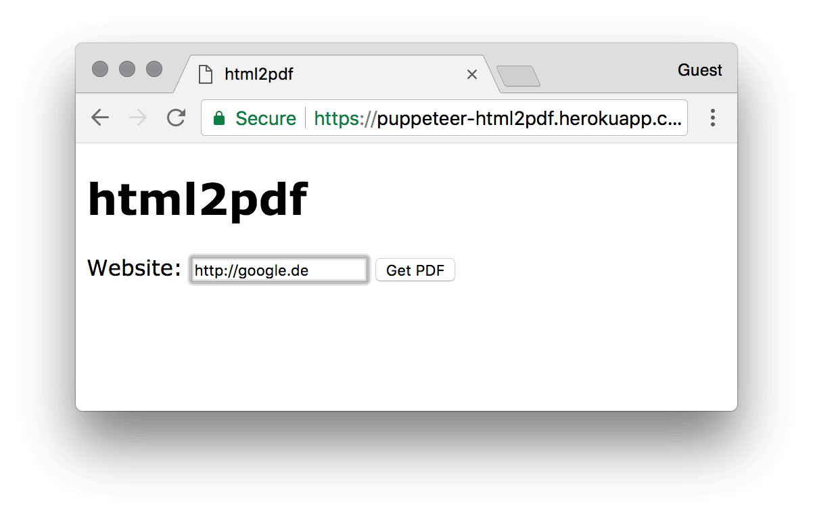

# puppeteer-html2pdf



The worlds most simplest website to PDF converter, based on [express](http://expressjs.com/) and [Puppeteer](https://github.com/GoogleChrome/puppeteer) (previously based on [nightmare](http://www.nightmarejs.org/) which can't run headless).

## Howto
```
npm i
npm start
```

Browse to http://localhost:4000/ and start converting websites to PDF files.  

## Howto Heroku

Fork this repo, adjust some settings. You can also directly auto deploy this repository, if you want. A free dyno is doog enough. 
Required Buildpacks:
* `heroku/nodejs`
* `https://github.com/jontewks/puppeteer-heroku-buildpack`

That's it. Start converting websites.

https://github.com/JohannesHoppe/puppeteer-html2pdf

# License

[The MIT License (MIT)](LICENSE)  

Copyright (c) 2018 Johannes Hoppe  
